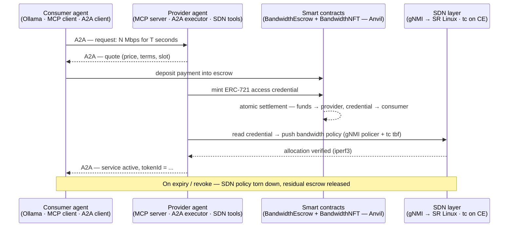

# Bandwidth Agent Simulation

> Two autonomous AI agents negotiate a network service, settle payment **on-chain** for a **tokenized access credential**, and that credential is enforced at runtime by an **SDN controller** — no human in the loop. Runs end-to-end on a laptop.

This is the proof-of-concept behind my Erasmus Mundus MSc thesis: one of the first end-to-end **tokenized service exchanges between two mutually untrusted AI agents**. A *consumer* agent and a *provider* agent discover each other, agree on terms, and complete an atomic on-chain trade — the provider mints an **ERC-721 access credential**, the consumer pays escrowed funds for it, and only then does the provider's SDN layer provision the bandwidth that credential represents. Built on the emerging agentic-web protocol stack: Google **A2A**, the **Model Context Protocol (MCP)**, an Ethereum smart-contract escrow on **Foundry / Anvil**, and a **Containerlab** SDN testbed.

> 📄 **Paper:** *"Autonomous Agent-to-Agent Network Service Provisioning via Smart-Contract Escrow and Tokenized Authorization"* — Orange Labs. Forthcoming, September 2026 (see [`paper`](paper)).

This README is the landing page. Deep documentation lives in [`docs/`](docs/).

---

## Why this matters

Today, "an AI agent buying a service" really means a human pre-provisioned an API key and a credit card. There is no machine-native way for two agents that don't trust each other to (a) agree on a price, (b) exchange money for a *verifiable right* to use a service, and (c) have that right enforced by the infrastructure itself. This project wires up exactly that loop for one concrete service — guaranteed bandwidth on a provider network — using the protocol stack the "agentic web" is converging on:

- **A2A (Agent-to-Agent)** — how the two agents find each other and exchange structured task messages.
- **MCP (Model Context Protocol)** — how each agent invokes its own capabilities (wallet, smart contract, SDN) as tools.
- **Smart-contract escrow + ERC-721** — the trust substrate: payment and the access credential change hands atomically, or not at all.
- **SDN (gNMI + Linux `tc` on Containerlab)** — the credential is not just a receipt; *holding it* is what gets you the bandwidth.

No real money and no real bandwidth are involved — payment is on a local Anvil chain, and the SDN layer is mocked by default (the real path uses the sibling repo [`srl-gnmi-bandwidth-poc`](https://github.com/musel25/srl-gnmi-bandwidth-poc)).

---

## The agent-to-agent flow



Step by step:

1. **Discovery & negotiation (A2A).** The consumer agent sends the provider agent a task: it wants a given rate for a given duration. The provider agent — reasoning with its own local LLM via Ollama — checks its slot pool and replies with a quote.
2. **Escrow deposit.** The consumer agent's wallet tool deposits the agreed amount into the `BandwidthEscrow` contract on the local Anvil chain.
3. **Tokenized authorization.** The provider's contract tool mints a `BandwidthNFT` — an **ERC-721** whose on-chain state encodes *which* service, *what* rate, and *for how long*. Settlement is atomic: in the same transaction the escrow releases funds to the provider **and** the credential to the consumer, so neither agent can be cheated by the other walking away mid-trade.
4. **Runtime enforcement (SDN).** Possession of the token *is* the authorization. The provider agent reads the credential, derives the policy, and pushes it to the network: a QoS policer to a Nokia SR Linux provider-edge router over **gNMI**, plus a Linux `tc tbf` shaper on the connected customer host. (Mocked by default; real enforcement via [`srl-gnmi-bandwidth-poc`](https://github.com/musel25/srl-gnmi-bandwidth-poc).)
5. **Confirmation.** The provider verifies the allocation with `iperf3` and reports back over A2A with the `tokenId`. The consumer now holds a credential it can present *and* bandwidth it can actually use.
6. **Expiry / revocation.** When the credential's term ends — or either side revokes — the SDN policy is torn down and any remaining escrowed value is released. The inverse of steps 4 → 2.

The key property: **the credential is the same object the network enforces.** It isn't "pay an invoice, then separately get configured" — the ERC-721 *is* the authorization, minted and paid for in one atomic step, and the SDN layer treats holding it as the right to the bandwidth.

---

## Architecture

```
┌──────────────────────┐         A2A          ┌──────────────────────┐
│   Consumer agent     │ ◀──────────────────▶ │   Provider agent     │
│   FastAPI            │                       │   FastAPI            │
│   Ollama (LLM)       │                       │   MCP server         │
│   MCP client         │                       │   A2A executor       │
│   A2A client         │                       │   SDN tools          │
│   wallet tool  ──────┼───┐               ┌───┼──────  contract tool │
└──────────────────────┘   │               │   └──────────────────────┘
                           ▼               ▼               │
                  ┌────────────────────────────────┐       │ gNMI / tc
                  │  Anvil — local Ethereum chain  │       ▼
                  │  BandwidthEscrow  (escrow)     │   ┌────────────────────┐
                  │  BandwidthNFT     (ERC-721)    │   │  SDN layer         │
                  └────────────────────────────────┘   │  SR Linux + CE     │
                                                        │  (Containerlab)    │
        Streamlit dashboard ───── observes ────────────▶│  mock by default   │
                                                        └────────────────────┘
```

| Path | Role |
|---|---|
| `consumer/` | Buyer agent — FastAPI service, Ollama for reasoning, MCP **client** for its tools, A2A client to talk to the provider |
| `provider/` | Seller agent — FastAPI service, MCP **server** exposing its tools, A2A executor, SDN tools (gNMI + `tc`) |
| `contracts/` | Solidity 0.8.x — `BandwidthEscrow` (deposit / settle / refund) and `BandwidthNFT` (ERC-721 access credential), with Foundry deploy scripts |
| `shared/` | Cross-agent code — config, A2A message types, contract ABIs, slot pool, Anvil / deploy helpers |
| `notebooks/` | `01_*` … `05_*` — every layer in-process from Python, no Docker; `05_end_to_end.ipynb` runs the whole flow |
| `tests/` | Pytest — unit + integration |
| `docs/` | Full documentation set (table below) |
| `paper/` | Companion research paper (separate git repo) |

---

## Quickstart

```bash
# 1. Install prereqs (see docs/04-running.md for details):
#    Foundry, Docker, Ollama, uv

# 2. Copy the example env file
cp .env.example .env

# 3. Bring everything up
make up

# 4. Open the dashboard
xdg-open http://localhost:8501   # or just open it in your browser

# 5. Run the scripted demo (no browser needed)
make demo
```

If `make demo` reports an active service with a `tokenId`, the full negotiate → escrow → mint → settle → provision → verify cycle worked.

Stop everything: `make down` (or `make down-clean` to wipe state too).

### Two ways to run

- **Docker stack** (above): one command brings up Anvil, both agents, Ollama, and the dashboard.
- **Notebooks** (`notebooks/01_*.ipynb` … `05_*.ipynb`): every layer in-process from Python, no Docker. See [`notebooks/README.md`](notebooks/README.md).

### Real SDN demo (optional)

The default demo uses a mocked SDN layer (`SDN_MOCK=true`). To exercise real bandwidth enforcement (gNMI policer push to Nokia SR Linux + `tc tbf` on the connected CE), clone the [`srl-gnmi-bandwidth-poc`](https://github.com/musel25/srl-gnmi-bandwidth-poc) sibling repo next to this one:

```bash
make clab-up      # stand up the Containerlab topology
make demo-real    # restart provider with SDN_MOCK=false, run demo, verify with iperf3
make clab-down    # tear down the topology
```

---

## Tech stack

- **Python 3.13**, `uv` for environment management
- **FastAPI** (agent HTTP servers) · **Streamlit** (observability dashboard)
- **FastMCP** (MCP servers) · **a2a-sdk** (inter-agent A2A calls)
- **Ollama** running `llama3.2:3b` locally (swappable — see [`docs/04-running.md`](docs/04-running.md))
- **Solidity 0.8.x** · **Foundry / Anvil** (escrow + ERC-721 credential)
- **gNMI** (`pygnmi`) + Linux **`tc tbf`** for SDN enforcement — mock by default; real path via [`srl-gnmi-bandwidth-poc`](https://github.com/musel25/srl-gnmi-bandwidth-poc) on **Containerlab** with Nokia SR Linux

---

## Status

Active research prototype — runs end-to-end. `make demo` completes a full negotiate → escrow → mint → settle → provision → verify cycle on a local Anvil chain with a mocked SDN layer; `make demo-real` runs the same flow against a live Containerlab topology with real gNMI + `tc` enforcement. Companion paper forthcoming, September 2026 (see [`paper`](paper)).

---

## Where to read next

| If you want to… | Read |
|---|---|
| Understand what this is and why | [`docs/01-introduction.md`](docs/01-introduction.md) |
| Learn the vocabulary (A2A, MCP, escrow, ERC-721, SDN) | [`docs/02-concepts.md`](docs/02-concepts.md) |
| Read or modify the code | [`docs/03-architecture.md`](docs/03-architecture.md) |
| Get it running on your machine | [`docs/04-running.md`](docs/04-running.md) |
| See the whole flow from a Python kernel | [`notebooks/05_end_to_end.ipynb`](notebooks/05_end_to_end.ipynb) |

If you've never seen this project before, read those docs in the order listed.
