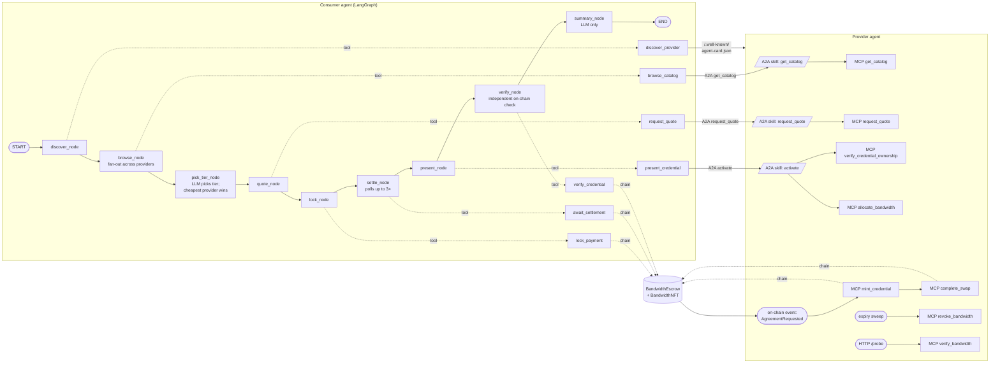

# Architecture Reference

> **Audience:** developers reading or modifying the code. Assumes you have already read [`01-introduction.md`](01-introduction.md) and the concepts you need from [`02-concepts.md`](02-concepts.md).

> **Where to make changes:**
>
> - **Add a new tier** → `provider/catalog.py` (`CATALOG` list) + `provider/inventory.txt` (one row per tier).
> - **Add a consumer MCP tool** → `consumer/mcp_server.py` inside `build_mcp_server`. If it should drive a graph node, add a key to `build_consumer_tools` and a node to `consumer/graph.py`.
> - **Add a provider MCP tool** → `provider/mcp_server.py` inside `build_mcp_server`. If it should be triggered by an A2A action, route it from `provider/agent_executor.py`.
> - **Change escrow / NFT semantics** → `contracts/src/*.sol`. Re-deploy via `make contracts` (Docker) or `shared.deploy.deploy_contracts(cfg)` (notebooks).
> - **Tweak the LangGraph flow** → `consumer/graph.py`'s `build_graph()`. Each node is a closure; add or reorder them in the builder section at the bottom.
> - **Change SDN backend** → swap the `srl_bandwidth.*` calls inside `provider/mcp_server.py`'s `allocate_bandwidth` / `revoke_bandwidth` / `verify_bandwidth` tools.
> - **Change config** → add a field to `Config` in `shared/config.py` and read it from `Config.from_env()`.

---

## 1. PROJECT IDENTITY

**ollama-agent-simulation** is a proof-of-concept multi-agent simulation where two autonomous AI agents — a Consumer and a Provider — negotiate, pay for, and activate internet bandwidth packages without human intervention.

Architecturally it follows the paper's split:
- **A2A is the inter-agent protocol.** Consumer ↔ Provider talk over Google's Agent2Agent SDK (JSON-RPC `message/send`, agent cards at `/.well-known/agent-card.json`). The provider's three skills are `get_catalog`, `request_quote`, and `activate`.
- **MCP is the intra-agent tool-invocation protocol.** Each agent runs its own FastMCP server. The provider's executor only calls the provider's MCP. The consumer's graph nodes call the consumer's MCP tools directly (passed in as a `tools` dict). Cross-agent calls are wrapped inside consumer MCP tools that internally use A2A.
- **SDN activation is real.** On `activate`, the provider verifies the NFT credential then calls `srl_bandwidth.allocate_bandwidth` (gNMI policer push to Nokia SR Linux + Linux `tc tbf` on the connected CE container) via the sibling repo `srl-gnmi-bandwidth-poc`. `SDN_MOCK=true` short-circuits this for CI/dev.
- **Atomic on-chain settlement.** Consumer locks ETH via `BandwidthEscrow.requestAgreement`; provider mints an ERC-721 credential via `BandwidthNFT.mint`; `BandwidthEscrow.deposit` swaps ETH→provider and NFT→consumer atomically. The signature/nonce/`ownerOf` check is an MCP tool (`verify_credential_ownership`) that the activate-handler calls — there is no separate gateway service.

This is a research prototype accompanying an academic paper.

### 1.1 Per-node tool map

The consumer is a deterministic LangGraph state machine (`consumer/graph.py`). Each node calls **exactly one** tool — three of them tunnel through A2A to the provider's skills, one is LLM-only with no tool, the rest are local/on-chain. The provider's executor (`provider/agent_executor.py`) maps each inbound A2A skill to one or two of its own MCP tools. Mint/swap is reactive, triggered by an on-chain `AgreementRequested` event handled by `provider/event_listener.py`. Expiry-driven revoke is run by `provider/expiry.py`. The iperf `/probe` endpoint is out-of-band.



Reading the diagram:
- Solid arrows inside each agent are LangGraph edges or executor dispatch.
- Dotted `tool` arrows are intra-agent tool calls (consumer: direct callable; provider: `Client(mcp)`).
- `A2A` arrows are inter-agent calls — the only network path between Consumer and Provider for the marketplace flow. The agent-card fetch goes over plain HTTPS, since A2A's spec puts the card at `/.well-known/agent-card.json`.
- `chain` arrows are Ethereum JSON-RPC against Anvil (the trust anchor).

The LLM only fires at `pick_tier_node` (one-word tier choice) and `summary_node` (cosmetic). Every other branch is deterministic Python.

**Marketplace properties this graph gives you:**
- *Discovery:* `discover_node` fetches each provider's agent card and drops any provider that doesn't advertise the required skills (`get_catalog`, `request_quote`, `activate`). Providers are configured via `PROVIDER_A2A_URLS` (comma-separated).
- *Cross-provider comparison:* `browse_node` fans out and `pick_tier_node` picks the cheapest provider for the chosen tier, so a cheaper offer wins automatically.
- *Independent verification:* `verify_node` reads `BandwidthNFT.getTokenMetadata` and `ownerOf` directly — the consumer never has to trust the provider's `activate` response. If the on-chain Mbps doesn't match the accepted quote, or the NFT isn't owned by the consumer's EOA, the workflow errors out.
- *A2A is the only inter-agent path:* the provider's mirror REST routes for catalog are demoted to `/_debug/catalog`, leaving A2A skills as the marketplace contract.

---

## 2. TECH STACK SUMMARY

| Component | Version | Role |
|---|---|---|
| Python | ≥3.13 | Runtime for all Python services |
| uv | (any recent) | Dependency & venv management |
| FastAPI | ≥0.136.0 | HTTP framework for consumer (:8001), provider (:8002) |
| Uvicorn | ≥0.44.0 (standard) | ASGI server |
| FastMCP | ≥3.2.4 | Per-agent MCP server; used in-memory via `Client(mcp)` |
| a2a-sdk | ≥1.0,<2.0 | Inter-agent protocol — agent cards, JSON-RPC `message/send`, executor |
| srl-bandwidth | git pin | Sibling repo: gNMI policer push + Linux tc enforcement (real SDN) |
| langgraph | ≥1.1.10 | Consumer's deterministic state machine |
| langchain-ollama | ≥1.1.0 | `ChatOllama` wrapper used by graph nodes that call the LLM |
| Ollama Python SDK | ≥0.6.1 | Used indirectly via `langchain-ollama`; serves model at :11434 |
| Streamlit | ≥1.56.0 | Chat UI at :8501 |
| web3.py | ≥6.0,<7 | Ethereum JSON-RPC client; signs and sends transactions |
| eth-account | ≥0.11.3 | Key management, signing, signature recovery |
| httpx | ≥0.28.1 | Sync/async HTTP client (UI→consumer, consumer→provider via A2A) |
| Pydantic | (bundled with FastAPI) | Request/response validation, A2A `data` part schemas |
| Solidity | ^0.8.20 | Smart contract language |
| Foundry (forge, anvil) | latest | EVM toolchain; Anvil runs the local chain at :8545 |
| OpenZeppelin Contracts | (Foundry lib) | ERC-721 base (`ERC721`, `ERC721Holder`, `Ownable`) |
| Docker / Docker Compose v2 | — | Container orchestration for the full stack |
| Ollama (container) | latest | Hosts LLM models locally; serves at :11434 inside Docker |
| llama3.2:3b | — | Default LLM model (auto-pulled by `ollama-pull`); any small chat model works |
| pytest | ≥9.0.3 | Unit + integration tests |
| pytest-asyncio | ≥1.3.0 | Async test support |

---

## 3. FULL DIRECTORY TREE

```
ollama-agent-simulation/
├── consumer/                  # Consumer agent package
│   ├── __init__.py
│   ├── app.py                 # FastAPI :8001 — lifespan builds Config + MCP + graph
│   ├── agent_card.py          # build_consumer_agent_card(cfg) → a2a.types.AgentCard
│   ├── a2a_client.py          # send_provider_action / fetch_agent_card helpers
│   ├── graph.py               # build_graph(cfg, tools) → compiled LangGraph state machine
│   ├── mcp_server.py          # build_mcp_server(cfg) → (FastMCP, quote_cache)
│   ├── tier_selection.py      # rank_catalog + deterministic_tier_pick (LLM fallback)
│   └── ui.py                  # Streamlit dashboard — port 8501
├── provider/                  # Provider agent package
│   ├── __init__.py
│   ├── app.py                 # FastAPI :8002 — lifespan builds MCP, A2A, listener, expiry sweep
│   ├── agent_card.py          # build_provider_agent_card(cfg) → 3 skills: catalog/quote/activate
│   ├── agent_executor.py      # BandwidthProviderExecutor — A2A → in-memory MCP bridge
│   ├── catalog.py             # CATALOG, pending_quotes, slot_pool, make_quote
│   ├── event_listener.py      # async run() — polls AgreementRequested, drives mint+swap
│   ├── expiry.py              # async expiry_sweep_loop() — revokes SDN for expired slots
│   ├── mcp_server.py          # build_mcp_server(cfg) → (FastMCP, tool_log deque)
│   └── inventory.txt          # JSONL slot inventory (mutated at runtime, fcntl-locked)
├── shared/                    # Cross-service utilities
│   ├── __init__.py
│   ├── a2a_messages.py        # Pydantic schemas for A2A `data` parts
│   ├── anvil.py               # contextmanager that spawns a local Anvil for notebooks/tests
│   ├── chain.py               # send_tx, extract_token_id, STATUS_NAMES, make_web3
│   ├── config.py              # Frozen Config dataclass + Config.from_env()
│   ├── contracts.py           # Loads ABIs + deployment addresses → contract objects
│   ├── deploy.py              # deploy_contracts(cfg) — wraps `forge script` for notebooks
│   ├── slot_pool.py           # SlotPool — fcntl-locked (pe, subinterface, ce) reservations
│   └── abi/
│       ├── BandwidthEscrow.json
│       └── BandwidthNFT.json
├── contracts/                 # Solidity smart contracts (Foundry project)
│   ├── src/
│   │   ├── BandwidthEscrow.sol   # Double-escrow contract — holds ETH + swaps for NFT
│   │   └── BandwidthNFT.sol      # ERC-721 entitlement token — on-chain metadata
│   ├── script/
│   │   └── Deploy.s.sol          # Deploys both contracts, writes deployments/local.json
│   ├── deployments/
│   │   └── local.json            # AUTO-GENERATED — contract addresses after deploy
│   ├── foundry.toml
│   └── foundry.lock
├── notebooks/                 # In-process demos (marimo, no Docker)
│   ├── 00_overview.py … 07d_network_router_config.py
│   │                           # 21 reactive .py notebooks across chain/MCP/A2A/graph/network
│   ├── blockchain_primer/      # Hands-on primer: anvil + cast + forge from zero
│   ├── from_scratch/           # 10-notebook from-scratch Ethereum implementation in Python
│   ├── _viz.py                 # Shared renderers used by walkthrough notebooks
│   └── README.md
├── tests/                     # 13 pytest files — see §12
├── docs/                      # This documentation set
├── paper/                     # Companion research paper (separate git submodule)
├── Dockerfile.consumer        # Multi-stage image — runs consumer/app.py or ui.py
├── Dockerfile.provider        # Multi-stage image — runs provider/app.py
├── docker-compose.yml         # 7 services: anvil, deployer, ollama, ollama-pull, provider-agent, consumer-agent, consumer-ui
├── Makefile                   # up, down, down-clean, logs, contracts, demo, clab-up, clab-down, demo-real
├── pyproject.toml             # uv project definition — all dependencies
├── uv.lock                    # Locked dependency graph
├── .env                       # Runtime secrets (gitignored; committed only here for convenience)
├── .env.example               # Documented env var template
├── .python-version            # Python version pin for uv
└── .streamlit/config.toml     # Dark theme for Streamlit
```

### File annotations

| File | Exports / Exposes | Imported by |
|---|---|---|
| `provider/catalog.py` | `CATALOG`, `CATALOG_BY_ID`, `pending_quotes`, `slot_pool`, `get_catalog_with_availability`, `make_quote`, `cleanup_quotes`, `QUOTE_TTL` | `provider/app.py`, `provider/mcp_server.py`, `provider/event_listener.py`, `provider/agent_executor.py`, `provider/expiry.py` |
| `provider/mcp_server.py` | `build_mcp_server(cfg) → (FastMCP, deque)` | `provider/app.py`, `provider/event_listener.py`, `tests/*` |
| `provider/event_listener.py` | `run(w3, mcp, poll_interval_s=2.0)` | `provider/app.py` |
| `provider/expiry.py` | `expiry_sweep_loop(mcp, period_seconds=30)` | `provider/app.py` |
| `provider/agent_executor.py` | `BandwidthProviderExecutor(mcp)` | `provider/app.py`, `tests/test_agent_executor.py` |
| `provider/app.py` | FastAPI `app`; `/_debug/catalog`, `/inventory`, `/address`, `/probe`, `/tool_log`, `/.well-known/agent-card.json`, `/.well-known/agent.json`, `/a2a`, `/mcp` (mounted) | uvicorn entry point |
| `consumer/mcp_server.py` | `build_mcp_server(cfg) → (FastMCP, quote_cache)` | `consumer/app.py`, `consumer/graph.py`, `tests/*` |
| `consumer/graph.py` | `build_graph(cfg, tools)`, `build_consumer_tools(cfg)` | `consumer/app.py`, `tests/test_consumer_graph.py` |
| `consumer/tier_selection.py` | `rank_catalog`, `deterministic_tier_pick` | `consumer/graph.py`, `tests/test_consumer_graph.py` |
| `consumer/a2a_client.py` | `send_provider_action(url, payload)`, `fetch_agent_card(url)` | `consumer/mcp_server.py` |
| `consumer/agent_card.py` | `build_consumer_agent_card(cfg)` | `consumer/app.py` |
| `consumer/app.py` | FastAPI `app`; `/.well-known/agent-card.json`, `/.well-known/agent.json`, `/chat`, `/log` (GET+DELETE), `/catalog_proxy`, `/address`, `/check_token`, `/probe_proxy`, `/chain_events` | uvicorn entry point; called by `consumer/ui.py` |
| `consumer/ui.py` | Streamlit app | Standalone — run with `streamlit run` |
| `shared/contracts.py` | `get_nft_contract(w3)`, `get_escrow_contract(w3)` | both apps + both MCP servers |
| `shared/chain.py` | `send_tx`, `extract_token_id`, `STATUS_NAMES`, `make_web3` | both apps + both MCP servers |
| `shared/config.py` | `Config` (frozen dataclass), `Config.from_env()` | every entry point |
| `contracts/deployments/local.json` | `{"bandwidthNFT": "0x...", "bandwidthEscrow": "0x..."}` | `shared/contracts.py` |
| `provider/inventory.txt` | JSONL — one row per tier, with `tier`, `mbps`, `durationSeconds`, `slots[]` (each slot has `pe`, `subinterface`, `ce`, `agreementId`, `expiresAt`) | `shared/slot_pool.py` (r/w with fcntl) |

---

## 4. ARCHITECTURE & PATTERNS

### Pattern: A2A inter-agent + per-agent MCP

Three HTTP services (consumer :8001, provider :8002, anvil :8545) communicate over the network. Each agent runs its own in-process FastMCP server. Cross-agent calls always go over A2A.

```
Browser
  │ POST /chat
  ▼
consumer/ui.py :8501          (Streamlit — thin HTTP client)
  │ POST /chat
  ▼
consumer/app.py :8001         (FastAPI; lifespan → graph + MCP)
  │
  ▼
LangGraph state machine (consumer/graph.py)
  │  invokes tools from build_consumer_tools(cfg)
  │
  ├─ wallet_address / lock_payment / await_settlement / verify_credential   (local + on-chain)
  │
  └─ discover_provider / browse_catalog / request_quote / present_credential
        │
        └─ a2a-sdk message/send ──────────────────────► provider :8002/a2a
                                                          DefaultRequestHandler
                                                          → BandwidthProviderExecutor
                                                          → [in-memory] Client(provider_mcp)
                                                            ├─ get_catalog
                                                            ├─ request_quote
                                                            ├─ verify_credential_ownership
                                                            ├─ allocate_bandwidth (SDN)
                                                            ├─ mint_credential (web3)
                                                            └─ complete_swap (web3)

[web3] requestAgreement() ───────────────────────────► Anvil :8545
                                                        (Ethereum chain)
                AgreementRequested event ◄──────────── provider/event_listener.py
                provider reserves slot, mints NFT, deposits → atomic swap
```

### Key patterns in use

**1. LangGraph state machine (`consumer/graph.py`):**
- `build_graph(cfg, tools)` returns a compiled graph with nodes: `discover_node → browse_node → pick_tier_node → quote_node → lock_node → settle_node → present_node → verify_node → summary_node` (+ `error_node` reachable via conditional edges).
- The LLM is consulted only at `pick_tier_node` (single-word tier choice via `ChatOllama`) and `summary_node` (cosmetic acknowledgement). All on-chain and A2A calls are deterministic Python.
- `build_consumer_tools(cfg)` builds the default tool dict by spinning up the consumer MCP server and exposing each registered tool's plain callable. Notebooks and tests can pass a hand-rolled dict instead.

**2. Atomic double-escrow (`BandwidthEscrow.sol::deposit()`):**
- Consumer calls `requestAgreement()` locking ETH → status = REQUESTED.
- Provider calls `deposit(agreementId, tokenId)` → checks-effects-interactions: status set to ACTIVE first, then `safeTransferFrom` NFT to escrow then to consumer, then `call{value}` ETH to provider. If ETH transfer fails, the entire transaction reverts.

**3. SlotPool — file-locked (pe, subinterface, ce) reservations (`shared/slot_pool.py`):**
- `inventory.txt` is JSONL with one row per tier; each row carries explicit per-slot bindings.
- `reserve(tier, agreement_id, duration_seconds)` returns a `Slot(pe, subinterface, ce)` or `None` if full.
- All reads/writes hold `fcntl.LOCK_EX`. Expired slots (`expiresAt < now`) are reclaimed on every read.
- `provider/expiry.py` runs a 30-second background sweep that revokes the SDN policy for any expired slot before releasing it.

**4. Signed-nonce credential verification (`provider/mcp_server.py::verify_credential_ownership`):**
- The provider recovers the signer with `Account.recover_message`, calls `ownerOf(tokenId)` on chain, and confirms the NFT's agreement is `ACTIVE`.
- Nonce window is ±300s (`NONCE_WINDOW`). The activation flow invokes this tool from `BandwidthProviderExecutor._handle_activate`.

**5. A2A Agent Cards (proto-based):**
- `a2a-sdk` 1.0.x exposes `a2a.types.AgentCard` as a protobuf-generated class. Construct with snake_case kwargs; serialize with `google.protobuf.json_format.MessageToDict(card, preserving_proto_field_name=True)`.
- Both agents serve `/.well-known/agent-card.json` (canonical) and `/.well-known/agent.json` (alias). Provider exposes 3 skills (`get_catalog`, `request_quote`, `activate`) at `/a2a` JSON-RPC.

**6. MCP server mounted on FastAPI (provider only):**
- `mcp.http_app()` is a Starlette sub-application mounted at root **after** all REST routes and the A2A routes are registered on `app.router`. Reversing the order would shadow REST/A2A with the MCP catch-all.
- The FastMCP lifespan is wrapped inside the FastAPI lifespan via `async with mcp_http.lifespan(app):` — required for the transport to initialize.

**7. Centralised chain helpers (`shared/chain.py`):**
- `send_tx(w3, account, key, func, value=0)` builds, signs, broadcasts, and waits for the receipt of any contract call. It supports both `signed.raw_transaction` and the older `signed.rawTransaction` and raises if `receipt.status != 1`.
- `extract_token_id(receipt, nft_contract)` decodes the `Transfer` event with the contract's own ABI (`process_receipt`) — no manual topic-hash parsing.
- `STATUS_NAMES` maps the Solidity `Status` enum (`NONE`/`REQUESTED`/`ACTIVE`/`CLOSED`/`CANCELLED`) to readable names for `escrow.getAgreement()` consumers.

---

## 5. ENTRY POINTS

| Entry point | Command | Port |
|---|---|---|
| Provider API + A2A + MCP | `uvicorn provider.app:app --port 8002` | 8002 |
| Consumer API + MCP | `uvicorn consumer.app:app --port 8001` | 8001 |
| Consumer UI | `streamlit run consumer/ui.py` | 8501 |

### Boot sequence — Provider (`provider/app.py`)

`lifespan` builds `Config` → MCP server → A2A handler → mounts MCP HTTP app, then enters MCP lifespan and spawns two background tasks. Modules expose factories (`build_mcp_server(cfg)`, `build_provider_agent_card(cfg)`) — no module-level state.

1. `Config.from_env()` resolves env vars; `make_web3(cfg)` builds the `w3` client.
2. `build_mcp_server(cfg)` returns `(FastMCP, tool_log)`. The tool_log is a 500-entry `deque` consumed by `/tool_log`.
3. Agent-card and JSON-RPC routes are appended to `app.router.routes` (so they win over the catch-all).
4. `mcp.http_app()` is mounted at `/`.
5. Inside `async with mcp_http.lifespan(app):`, two tasks are created:
   - `event_listener.run(w3, mcp)` polls `escrow.events.AgreementRequested.get_logs(...)` every 2 s. On each event, spawns `_handle(...)` which mints NFT → calls `complete_swap`.
   - `expiry_sweep_loop(mcp, period_seconds=30)` sweeps expired slots, revokes their SDN policy, and frees them.
6. REST routes respond immediately; MCP endpoint at `/mcp` serves tool discovery and calls.

### Boot sequence — Consumer (`consumer/app.py`)

Same factory pattern. `lifespan` builds `Config` → MCP server → tools → graph → agent card and stashes them on `app.state`.

1. `Config.from_env()` → `build_mcp_server(cfg)` → `build_consumer_tools(cfg)` → `build_graph(cfg, tools)`.
2. On `POST /chat`: pulls the graph off `app.state` and invokes `graph.ainvoke({...})`.
3. The graph drives the deterministic node sequence; each node calls exactly one tool.

### Contract deployment (one-time, `contracts/script/Deploy.s.sol`)

1. `forge script` runs `Deploy.run()`.
2. Deploys `BandwidthNFT(providerAddress)` — provider EOA becomes the Ownable owner (only they can mint).
3. Deploys `BandwidthEscrow(nftAddress)`.
4. Writes `contracts/deployments/local.json` with both addresses.

---

## 6. DATA MODELS & SCHEMA

### Solidity: `Agreement` struct (`BandwidthEscrow.sol`)

```
Agreement {
  consumer        address
  provider        address
  bandwidthMbps   uint256
  durationSeconds uint256
  priceWei        uint256    — msg.value from requestAgreement
  requestDeadline uint256    — block.timestamp + 1 hour
  tokenId         uint256    — set to 0 until deposit(), then NFT token ID
  status          Status     — NONE(0)|REQUESTED(1)|ACTIVE(2)|CLOSED(3)|CANCELLED(4)
}
```

Stored in `mapping(uint256 => Agreement) private _agreements` keyed by `agreementId`. The status slot lives at index 7 of the struct tuple returned by `getAgreement`.

### Solidity: `TokenMetadata` struct (`BandwidthNFT.sol`)

```
TokenMetadata {
  agreementId     uint256
  bandwidthMbps   uint256
  durationSeconds uint256
  startTime       uint256    — block.timestamp at mint
  endpoint        string     — "clab://{pe}/{subinterface}"
}
```

Stored in `mapping(uint256 => TokenMetadata) private _metadata` keyed by `tokenId`. All on-chain; no IPFS.

### Python: Catalog entry (`provider/catalog.py`)

```python
{
  "packageId": "small"|"medium"|"large",
  "mbps": int,            # 2 | 5 | 8
  "durationSeconds": int, # 600 for all tiers
  "priceWei": int,        # Web3.to_wei(0.01|0.02|0.08, "ether")
}
```

Extended with `"availableSlots": int` when returned by `get_catalog_with_availability()`.

### Python: Pending quote (`provider/catalog.py::pending_quotes`)

```python
pending_quotes: dict[int, dict]  # keyed by agreementId (128-bit random int)
# value:
{
  "packageId": str,
  "consumerAddress": str,
  "expires": float,        # time.time() + QUOTE_TTL (300s)
  "priceWei": int,
  "bandwidthMbps": int,
  "durationSeconds": int,
}
```

Quote TTL is 300 seconds (`QUOTE_TTL`). `cleanup_quotes()` is called by `event_listener._handle()` before processing each event.

### Python: Quote response (cached in consumer `quote_cache`)

```python
{
  "agreementId": int|str,  # 128-bit random; stored under str key in quote_cache
  "priceWei": int,
  "bandwidthMbps": int,
  "durationSeconds": int,
  "providerAddress": str,  # added by request_quote tool after fetching /address
}
```

`consumer/mcp_server.py::quote_cache` is `dict[str, dict]` — keyed by `str(agreementId)` because JSON loses int precision for 128-bit integers.

### Python: Inventory row (`provider/inventory.txt`, JSONL)

```json
{"tier": "small", "mbps": 2, "durationSeconds": 600, "slots": [
  {"pe": "pe1", "subinterface": "ethernet-1/2.0", "ce": "ce1",
   "agreementId": null, "expiresAt": null}
]}
```

One JSON line per tier. Slots with `expiresAt < time.time()` are reclaimed on every read (their `agreementId`/`expiresAt` reset to `null`).

### Python: Inter-agent log entry

```python
{"from": "consumer"|"provider", "message": str}
```

Held inside the per-request graph state (LangGraph `WorkflowState["log"]`). Each `/chat` invocation populates a fresh list; the FastAPI app caches the most recent log on `app.state.inter_agent_log` for `/log` to serve.

### Python: ChatRequest / ChatResponse (`consumer/app.py`)

```python
ChatRequest:  { message: str, model: str | None }
ChatResponse: { response: str, log: list[dict], thinking: list[str] }
```

---

## 7. API & INTERFACES

### Provider Agent (:8002)

| Method | Path | Input | Output | Side effect |
|---|---|---|---|---|
| GET | `/.well-known/agent-card.json` | — | proto-derived AgentCard dict | none |
| GET | `/.well-known/agent.json` | — | alias of `/agent-card.json` | none |
| POST | `/a2a` | JSON-RPC `message/send` | JSON-RPC response (Task + artifact) | dispatches to `BandwidthProviderExecutor` |
| GET | `/_debug/catalog` | — | `list[CatalogEntry]` with `availableSlots` | reads inventory via SlotPool |
| GET | `/inventory` | — | same as `/_debug/catalog` | same |
| GET | `/address` | — | `{"address": str}` | none |
| POST | `/probe` | `{tokenId}` | iperf3 probe result | runs `verify_bandwidth` tool |
| GET | `/tool_log` | `?since_ts=...` | recent MCP tool invocations | none |
| `/mcp` | MCP HTTP transport | MCP protocol | MCP protocol | mounted; primarily used in-memory by the executor |

**A2A actions (`parts[0].data.action`):**
- `get_catalog` → returns `{catalog: [...]}`
- `request_quote` (`package_id`, `consumer_address`) → returns `{agreementId, priceWei, bandwidthMbps, durationSeconds}` (agreementId is stringified)
- `activate` (`token_id`, `nonce`, `signature`) → returns `{status: "active"|"denied", bandwidth_mbps, seconds_remaining, endpoint, allocation, reason?}`

**Provider MCP tools (`build_mcp_server(cfg)`):**
- `get_catalog`, `request_quote`
- `verify_credential_ownership(token_id, signature, nonce)`
- `mint_credential(agreement_id, consumer_address, pe, subinterface, ce, mbps, duration_seconds)`
- `complete_swap(agreement_id, token_id)`
- `allocate_bandwidth(customer_id, pe, subinterface, mbps)` — honours `SDN_MOCK`
- `revoke_bandwidth(customer_id, pe, subinterface)`
- `verify_bandwidth(src_ce, dst_ce, expected_mbps, tolerance)`

Every provider MCP tool is wrapped by a `_make_logged` decorator that records each invocation to a 500-entry `deque` exposed via `/tool_log`.

### Consumer Agent (:8001)

| Method | Path | Input | Output | Side effect |
|---|---|---|---|---|
| GET | `/.well-known/agent-card.json` | — | proto-derived AgentCard dict | none |
| GET | `/.well-known/agent.json` | — | alias | none |
| POST | `/chat` | `ChatRequest` | `ChatResponse` | runs the LangGraph; on-chain txs via `lock_payment`; A2A round-trips inside `discover/browse/quote/present` tools |
| GET | `/log` | — | `list[dict]` | returns the most recent graph-run log |
| DELETE | `/log` | — | `{"cleared": True}` | resets the cached log on `app.state` |
| GET | `/catalog_proxy` | — | `list[dict]` | calls consumer MCP `browse_catalog(provider_url=PROVIDER_A2A_URLS[0])` |
| GET | `/address` | — | `{"address": str}` | calls consumer MCP `wallet_address` |
| GET | `/check_token` | `?tokenId=...` | NFT status dict | calls consumer MCP `verify_credential` |
| POST | `/probe_proxy` | `{tokenId}` | provider probe result | forwards to provider `/probe` |
| GET | `/chain_events` | `?since_block=...` | escrow + NFT events | reads chain via web3 |

### Consumer MCP tools (`build_mcp_server(cfg)`)

Local (no network):
- `wallet_address() -> str`
- `lock_payment(agreement_id) -> "OK <txHash>"|"ERROR ..."`
- `await_settlement(agreement_id) -> "OK tokenId=N"|"PENDING"|"ERROR ..."` (polls up to ~30s)
- `verify_credential(token_id) -> JSON` (independent on-chain check)

A2A-bound (open a fresh `a2a-sdk` client per call, via `consumer/a2a_client.py`):
- `discover_provider(provider_url) -> JSON {name, version, skills}`
- `browse_catalog(provider_url) -> JSON catalog`
- `request_quote(provider_url, package_id) -> JSON quote` (caches `providerAddress` for `lock_payment`)
- `present_credential(provider_url, token_id) -> JSON activate result`

### Smart contract interfaces

**`BandwidthEscrow`**
- `requestAgreement(agreementId, provider, bandwidthMbps, durationSeconds) payable`
- `deposit(agreementId, tokenId)` — atomic swap
- `cancel(agreementId)` — consumer anytime, or anyone after deadline
- `getAgreement(agreementId) view returns (Agreement)`
- Events: `AgreementRequested`, `AgreementActive`, `AgreementCancelled`

**`BandwidthNFT`**
- `mint(to, agreementId, bandwidthMbps, durationSeconds, endpoint) onlyOwner returns (tokenId)`
- `getTokenMetadata(tokenId) view returns (TokenMetadata)`
- Inherits: `ownerOf`, `approve`, `safeTransferFrom`

---

## 8. STATE MANAGEMENT

### Provider-side state

| State | Location | Type | Mutated by |
|---|---|---|---|
| Pending quotes | `provider/catalog.py::pending_quotes` | `dict[int, dict]` in-memory | `make_quote()` adds; `cleanup_quotes()` and explicit `del` in `event_listener._handle()` remove |
| Slot inventory | `provider/inventory.txt` | JSONL file, fcntl-locked | `slot_pool.reserve()`, `slot_pool.release()`; expired slots reclaimed on every read |
| Tool log | `app.state.tool_log` | 500-entry `deque` | every MCP tool invocation (via `_make_logged` decorator) |
| On-chain agreements | `BandwidthEscrow._agreements` | Solidity mapping | `requestAgreement()`, `deposit()`, `cancel()` |
| NFT ownership | `BandwidthNFT._metadata` + ERC-721 base | Solidity mappings | `mint()`, `safeTransferFrom()` |

### Consumer-side state

| State | Location | Type | Lifetime |
|---|---|---|---|
| Quote cache | `consumer/mcp_server.py::quote_cache` (closed over by tool functions) | `dict[str, dict]` in-memory | Process lifetime; populated by `request_quote` after a successful A2A round-trip |
| Inter-agent log | LangGraph `WorkflowState["log"]` + `app.state.inter_agent_log` | `list[dict]` per request | Reset on each `/chat`; cached on app state for `/log` |
| LLM cache | local closure in `build_graph` | `dict[str, ChatOllama]` | Process lifetime; one client per model name |

### UI state (Streamlit `session_state`)

| Key | Type | Purpose |
|---|---|---|
| `chat_history` | `list[dict]` | Full chat messages |
| `timeline` | `list[dict]` | A2A wire bubbles + on-chain markers |
| `consumer_tool_log` | `list[dict]` | Parsed `[MCP]/[A2A]` markers from `/chat` log |
| `provider_tool_log` | `list[dict]` | Entries from provider `/tool_log` |
| `chain_events` | `list[dict]` | Entries from consumer `/chain_events` |
| `probe_samples` | `list[dict]` | iperf3 probe results |
| `turn` | `int` | Monotonic turn counter |
| `ui_state_version` | `int` (4) | Version-gated state reset on schema changes |

---

## 9. DEPENDENCY MAP

### Key imports per file

**`provider/app.py`** — `provider.{agent_card, agent_executor, catalog, event_listener, expiry, mcp_server}`, `shared.{chain, config, contracts}`, `a2a.server.*`, `fastmcp`, `fastapi`, `uvicorn`, `eth_account`.

**`provider/mcp_server.py`** — `provider.catalog` (catalog + quote helpers), `shared.{chain, config, contracts}`, `eth_account`, `fastmcp`, `web3`. Optionally `srl_bandwidth.*` when `SDN_MOCK=false`.

**`provider/catalog.py`** — `web3` (only `Web3.to_wei`), `shared.slot_pool`, stdlib (`secrets`, `time`, `pathlib`).

**`provider/agent_executor.py`** — `a2a.server.*`, `a2a.types`, `fastmcp`, `google.protobuf.*`, `provider.catalog` (slot_pool), `shared.a2a_messages`.

**`provider/event_listener.py`** — `provider.catalog`, `shared.contracts`, `fastmcp`, `web3`.

**`provider/expiry.py`** — `provider.catalog` (slot_pool), `fastmcp`, stdlib (`fcntl`, `json`, `time`).

**`consumer/app.py`** — `consumer.{agent_card, graph, mcp_server}`, `shared.{chain, config, contracts}`, `fastmcp`, `fastapi`, `uvicorn`, `httpx`.

**`consumer/mcp_server.py`** — `consumer.a2a_client`, `shared.{chain, config, contracts}`, `eth_account`, `fastmcp`, `httpx`, `web3`.

**`consumer/graph.py`** — `consumer.tier_selection`, `shared.config`, `langchain_ollama`, `langgraph`. (`build_consumer_tools` lazily imports `consumer.mcp_server`.)

**`consumer/ui.py`** — `httpx`, `streamlit`. No import from any local Python module — communicates only via HTTP.

**`shared/contracts.py`** — `web3`, `json`, `pathlib`. Reads `contracts/deployments/local.json` and `shared/abi/*.json`.

### Most-imported shared files

1. `shared/config.py` — every entry point and most modules
2. `shared/chain.py` — both apps + both MCP servers + tests
3. `shared/contracts.py` — both apps + both MCP servers
4. `provider/catalog.py` — five different provider modules

### No circular dependencies.

---

## 10. CONFIGURATION & ENVIRONMENT

### Environment variables

| Variable | Required | Default | What it controls |
|---|---|---|---|
| `PROVIDER_PRIVATE_KEY` | YES | — | Provider EOA key; signs provider txs and is the NFT contract owner |
| `CONSUMER_PRIVATE_KEY` | YES | — | Consumer EOA key; signs consumer txs and credential nonces |
| `DEPLOYER_PRIVATE_KEY` | YES (deploy only) | — | Used by `Deploy.s.sol` and `shared.deploy.deploy_contracts` |
| `PROVIDER_ADDRESS` | YES (deploy only) | — | Passed to `BandwidthNFT` constructor as initial Ownable owner |
| `RPC_URL` | No | `http://localhost:8545` | Ethereum JSON-RPC endpoint |
| `PROVIDER_BASE_URL` | No | `http://localhost:8002` | Provider's own published base URL (used in its agent card) |
| `PROVIDER_A2A_URLS` | No | falls back to `PROVIDER_BASE_URL` | Comma-separated list of providers the consumer should discover |
| `CONSUMER_BASE_URL` | No | `http://localhost:8001` | Consumer's own published base URL (used in its agent card) |
| `OLLAMA_MODEL` | No | `llama3.2:3b` | Default LLM model name |
| `OLLAMA_HOST` | No | `http://localhost:11434` | Ollama server URL |
| `SDN_MOCK` | No | `true` | Skip real network hardware when `true` |

### Config files

| File | Role |
|---|---|
| `pyproject.toml` | uv project definition, Python version, all deps |
| `uv.lock` | Locked dependency graph — must be committed and kept in sync |
| `.env` | Runtime env vars — committed in this repo with Anvil test keys (not for prod) |
| `.env.example` | Template with documentation |
| `.python-version` | uv Python version pin |
| `.streamlit/config.toml` | Dark theme for Streamlit |
| `contracts/deployments/local.json` | Auto-generated by `Deploy.s.sol`. Both services read this at every contract call via `shared/contracts.py`. Missing → `FileNotFoundError`. |
| `provider/inventory.txt` | Runtime state for slot inventory — must exist before provider starts. Tests snapshot and restore it; the end-to-end test asserts no leakage. |
| `.claude/settings.local.json` | Claude Code project permissions |

### Docker networking

In Docker Compose, all services communicate by container name:
- `http://anvil:8545` — blockchain
- `http://provider-agent:8002` — provider REST + A2A + MCP
- `http://consumer-agent:8001` — consumer REST + MCP
- `http://ollama:11434` — LLM inference

The `consumer-agent` service sets `OLLAMA_HOST=http://ollama:11434`. If you run locally without Docker, Ollama must be running on `localhost:11434`.

---

## 11. KNOWN QUIRKS & CONSTRAINTS

1. **`quote_cache` uses string keys, `pending_quotes` uses int keys.** The `agreementId` is a 128-bit random integer. JSON cannot round-trip a 128-bit int faithfully, so `consumer/mcp_server.py::quote_cache` stores it as `str(agreementId)`. `provider/catalog.py::pending_quotes` uses raw `int`. When `lock_payment` calls `int(agreement_id)` to parse the string back, this works — but a browser-native consumer would need `BigInt` handling.

2. **MCP mount ordering is load-bearing.** In `provider/app.py`, `app.mount("/", mcp_http)` must come after agent-card and `/a2a` JSON-RPC routes are appended to `app.router.routes`. FastMCP's sub-application would otherwise shadow them.

3. **FastMCP lifespan is nested inside FastAPI lifespan.** `provider/app.py` enters `async with mcp_http.lifespan(app):` before spawning the event listener and expiry tasks. Removing this nesting breaks MCP transport initialisation.

4. **A2A client opens a new connection per call.** `consumer/a2a_client.send_provider_action` opens an `httpx.AsyncClient` and resolves the agent card every call — about one extra HTTP round-trip per `discover_provider`/`browse_catalog`/`request_quote`/`present_credential`. Acceptable for a purchase flow (≤4 A2A calls); would be a bottleneck if the LLM looped on these.

5. **Inventory is file-backed, not database-backed.** `provider/inventory.txt` is written with `fcntl.LOCK_EX`. This works in a single-container deployment but races if the provider is horizontally scaled (multiple processes writing the same file).

6. **`pending_quotes` is in-process memory on the provider.** If the provider restarts between a consumer's `request_quote` and the `AgreementRequested` event, the listener will not find the quote and skip it. The consumer's ETH remains locked in escrow and must be reclaimed via `cancel()` after the 1-hour deadline.

7. **NFT mint-before-approve-before-deposit is a three-step sequence.** If the provider crashes after `mint_credential` but before `complete_swap`, the NFT is orphaned. No on-chain recovery mechanism exists.

8. **The `endpoint` field in NFT metadata encodes the slot.** `mint_credential` writes `clab://{pe}/{subinterface}` so the credential is bound to a specific physical resource. The string is informational on chain; the activate path uses `slot_pool.lookup(agreement_id)` to resolve the actual `(pe, subinterface, ce)`.

9. **`QUOTE_TTL = 300s`.** `provider/catalog.py` rejects agreements whose quote has expired. 300 seconds is wide enough to cover slow LLM tier-pick + lock_payment mining on small local models without letting a stale quote outlive the slot.

10. **`web3.py` raw transaction compat shim.** `shared/chain.py::send_tx` does `getattr(signed, "raw_transaction", None) or signed.rawTransaction` — older web3.py versions used `rawTransaction`, newer use `raw_transaction`.

11. **Settlement polling has bounded retries.** `await_settlement` polls 20×1.5s ≈ 30s before returning `PENDING`; the graph then retries `settle_node` up to `_SETTLE_MAX_ATTEMPTS = 3` times before erroring. This caps total wait at ~90s.

---

## 12. TEST SUITE

`tests/` contains 13 files; run with `uv run pytest tests/`.

| File | What it covers |
|---|---|
| `conftest.py` | Shared fixtures (`consumer_cfg`, `provider_cfg`, `fake_catalog`) |
| `test_anvil.py` | `shared.anvil` spawns and tears down a local Anvil (skipped without `anvil` binary) |
| `test_catalog.py` | `CATALOG`, `make_quote` |
| `test_chain_factory.py` | `make_web3` honours `cfg.rpc_url` |
| `test_config.py` | `Config.from_env()` and frozen-dataclass behaviour |
| `test_slot_pool.py` | Reserve / release / lookup / expiry reclaim |
| `test_consumer_mcp.py` | Consumer MCP: wallet/lock + A2A-bound (mocked) |
| `test_consumer_app.py` | Consumer FastAPI routes (`/chain_events` with mocked web3) |
| `test_consumer_graph.py` | LangGraph happy path + error branches + tier-selection helpers |
| `test_provider_mcp.py` | Provider MCP: verify_credential / mint / swap (mocked) + tool_log |
| `test_provider_app.py` | Provider FastAPI `/tool_log` filtering |
| `test_agent_executor.py` | A2A executor end-to-end (catalog/quote/error) with proto-wrapped Parts |
| `test_end_to_end.py` | Full Anvil + deploy + in-process FastAPI apps + stubbed LLM (skipped without `anvil`/`forge`) |

---

## 13. HOW TO MAKE SAFE MODIFICATIONS

### High-sensitivity files (change with care)

| File | Why sensitive | What to verify after change |
|---|---|---|
| `provider/app.py` | MCP lifespan nesting; mount ordering; background tasks | MCP tools still discoverable at `/mcp`; `/inventory` still responds; `AgreementRequested` events still drive mint+swap |
| `provider/catalog.py` | Quote TTL; CATALOG schema; slot pool wiring | Run `tests/test_catalog.py` and `tests/test_slot_pool.py` |
| `consumer/app.py` / `consumer/graph.py` | `lifespan` wires Config → MCP → graph; do not introduce module-level state | Full end-to-end purchase still completes |
| `shared/contracts.py` | Single source for contract addresses and ABIs | Any change here breaks all three services simultaneously |
| `shared/chain.py` | `send_tx` powers every signed tx; `extract_token_id` decodes mint receipts | Run the full mocked test suite + `test_end_to_end.py` if Anvil is available |
| `contracts/src/BandwidthEscrow.sol` | ABI changes require regenerating `shared/abi/BandwidthEscrow.json` | After Solidity change: `forge build`, copy ABI, redeploy |
| `contracts/src/BandwidthNFT.sol` | Changing `TokenMetadata` field order breaks `verify_credential_ownership` and `verify_credential` tuple unpacks | Same as above |

### Tightly coupled pairs (change one → must change the other)

- `BandwidthEscrow.sol getAgreement()` tuple order ↔ `STATUS_NAMES`/`ag[7]` indexing in `consumer/mcp_server.py` and `provider/mcp_server.py`
- `BandwidthNFT.sol TokenMetadata` field order ↔ destructuring in `provider/mcp_server.py::verify_credential_ownership` and `consumer/mcp_server.py::verify_credential`
- `provider/catalog.py make_quote()` keys ↔ `consumer/mcp_server.py request_quote()` cache population
- `provider/inventory.txt` schema ↔ `shared/slot_pool.py::SlotPool` reader/writer

### What to test after any change

1. `uv run pytest tests/` — fast unit + integration tests (skips Anvil-only ones if the binary is missing)
2. `uv run pytest tests/test_end_to_end.py` — full local stack (requires `anvil` + `forge`)
3. After provider/MCP changes: `curl http://localhost:8002/inventory` and `make demo`
4. After Solidity changes: `cd contracts && forge build`, copy `out/<name>.sol/<Name>.json#abi` to `shared/abi/`, redeploy
5. After UI changes: run Streamlit locally and complete a purchase
